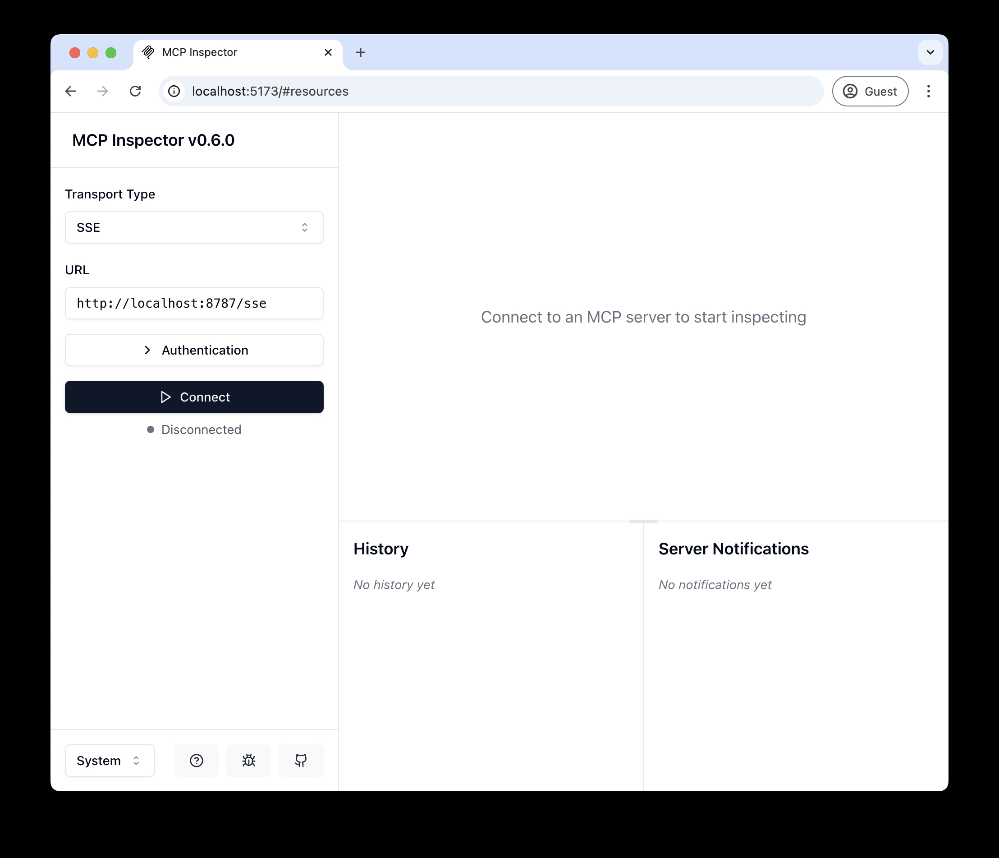

# Remote MCP Server on Cloudflare

Let's get a remote MCP server up-and-running on Cloudflare Workers complete with OAuth login!

## Develop locally

```bash
# clone the repository
git clone git@github.com:hemanth/remote-mcp-server.git

# install dependencies
cd remote-mcp-server
npm install

# run locally
npm run dev
```

You should be able to open [`http://localhost:8787/`](http://localhost:8787/) in your browser

## Connect the MCP inspector to your server

To explore your new MCP api, you can use the [MCP Inspector](https://modelcontextprotocol.io/docs/tools/inspector).

- Start it with `npx @modelcontextprotocol/inspector@latest`
- [Within the inspector](http://localhost:5173), switch the Transport Type to `SSE` and enter `http://localhost:8787/sse` as the URL of the MCP server to connect to, and click "Connect"
- You will navigate to a (mock) user/password login screen. Input any email and pass to login.
- You should be redirected back to the MCP Inspector and you can now list and call any defined tools!

<div align="center">
  
</div>

<div align="center">
  
</div>

## Connect Claude Desktop to your local MCP server

The MCP inspector is great, but we really want to connect this to Claude! Follow [Anthropic's Quickstart](https://modelcontextprotocol.io/quickstart/user) and within Claude Desktop go to Settings > Developer > Edit Config to find your configuration file.

Open the file in your text editor and replace it with this configuration:

```json
{
  "mcpServers": {
    "math": {
      "command": "npx",
      "args": [
        "mcp-remote",
        "http://localhost:8787/sse"
      ]
    }
  }
}
```

This will run a local proxy and let Claude talk to your MCP server over HTTP

When you open Claude a browser window should open and allow you to login. You should see the tools available in the bottom right. Given the right prompt Claude should ask to call the tool.

<div align="center">
  
</div>

<div align="center">
  
</div>

## Deploy to Cloudflare

1. `npx wrangler@latest kv namespace create remote-mcp-server-oauth-kv`
2. Follow the guidance to add the kv namespace ID to `wrangler.jsonc`
3. `npm run deploy`

## Call your newly deployed remote MCP server from a remote MCP client

Just like you did above in "Develop locally", run the MCP inspector:

`npx @modelcontextprotocol/inspector@latest`

Then enter the `workers.dev` URL (ex: `worker-name.account-name.workers.dev/sse`) of your Worker in the inspector as the URL of the MCP server to connect to, and click "Connect".

You've now connected to your MCP server from a remote MCP client.

## Using the Standalone MCP Client Example

This project includes a standalone MCP client example that demonstrates how to connect to the MCP server programmatically and call its tools. This is useful for testing, integration, or building custom applications that interact with the MCP server.

The client code is located in `src/client/mcp-client.ts`, and an example script to run it is `src/run-client.ts`.

### Prerequisites

1.  **Server Running**: Ensure the MCP server is running, either locally (`npm run dev` or `npx nx dev remote-mcp-server`) or deployed.
2.  **Client Credentials**: The client uses OAuth 2.0 client credentials to authenticate.
    *   For local development, the example client (`src/run-client.ts`) is pre-configured with test credentials (`test-client` / `test-secret`). These credentials are expected by the default OAuth provider setup if no specific client registration is implemented on the server-side.
    *   If you have a specific client registration system on your OAuth server, you'll need to register the client and obtain a client ID and secret.

### Running the Client Example

1.  **Set Environment Variables (Optional)**:
    The client script `src/run-client.ts` can be configured via environment variables:
    *   `MCP_SERVER_URL`: The base URL of the MCP server (e.g., `http://localhost:8787` or your deployed worker URL). Defaults to `http://localhost:8787`.
    *   `MCP_CLIENT_ID`: The OAuth client ID. Defaults to `test-client`.
    *   `MCP_CLIENT_SECRET`: The OAuth client secret. Defaults to `test-secret`.

    You can set these in your shell:
    ```bash
    export MCP_SERVER_URL="http://your-server-url"
    export MCP_CLIENT_ID="your-client-id"
    export MCP_CLIENT_SECRET="your-client-secret"
    ```

2.  **Execute the script**:
    Run the following command from the project root:
    ```bash
    npm run run:client
    ```

    This will execute `src/run-client.ts` using `ts-node`. The script will attempt to connect to the server, authenticate, and call the example `add` tool.

    **Note**: The initial version of the client has placeholder implementations for the actual SDK client instantiation (`new McpClient(...)`) and tool invocation (`client.callTool(...)`) within `src/client/mcp-client.ts`. You may need to update these parts based on the specific APIs provided by the `@modelcontextprotocol/sdk` once they are fully determined, for the tool calls to succeed. The authentication part (`getAccessToken`) should work if the server's OAuth `/token` endpoint is operational.

## Connect Claude Desktop to your remote MCP server

Update the Claude configuration file to point to your `workers.dev` URL (ex: `worker-name.account-name.workers.dev/sse`) and restart Claude 

```json
{
  "mcpServers": {
    "math": {
      "command": "npx",
      "args": [
        "mcp-remote",
        "https://worker-name.account-name.workers.dev/sse"
      ]
    }
  }
}
```

## Debugging

Should anything go wrong it can be helpful to restart Claude, or to try connecting directly to your
MCP server on the command line with the following command.

```bash
npx mcp-remote@latest http://localhost:8787/sse
```

In some rare cases it may help to clear the files added to `~/.mcp-auth`

```bash
rm -rf ~/.mcp-auth
```

## Using the xkcd Tool

The `xkcd` tool fetches a random xkcd comic image URL along with its alt text. Here's how you can use it:

1. Connect to your MCP server using the MCP Inspector or Claude Desktop as described above.
2. Call the `xkcd` tool.

Example using the MCP Inspector:

- In the MCP Inspector, select the `xkcd` tool from the list of available tools.
- Click "Invoke" to fetch a random xkcd comic.

Example using Claude Desktop:

- Open Claude Desktop and ensure it is connected to your MCP server.
- Use a prompt like "Fetch a random xkcd comic using the xkcd tool."

The response will include the image URL and the alt text of the random xkcd comic.
